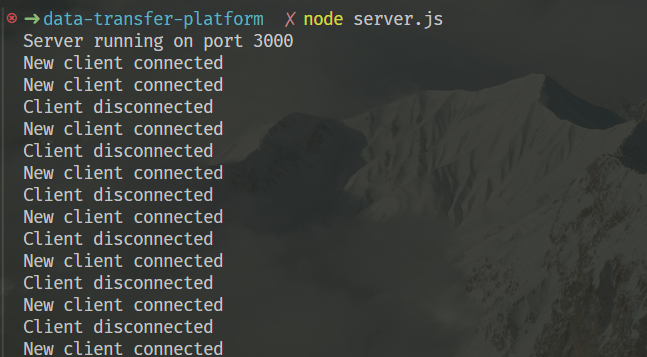

# Data Transfer Platform 📂
## Features ✨
- This project is a simple data transfer platform that allows users to upload text and files through a web interface. 
## Stack 🛠
- The backend is built with Node.js and Express, and it uses Socket.IO for real-time communication between the client and server. Files and text are temporarily stored on the server in the uploads directory.

## Getting Started 🚀
### Prerequisites
- Node.js and npm installed on your system.
## Installation
1. Clone the repository to your local machine.
   ```sh
    git clone https://github.com/nithamitabh/DATA-TRANSFER-PLATFORM.git
   ```
2. Navigate to the project directory.
   ```sh
    cd DATA-TRANSFER-PLATFORM
   ```
3. Install the necessary dependencies by running:
4. Start the server with:
   ```sh
    npm start
   ```
    or if you prefer using Node directly:

    ```sh
    node server.js
    ```
1. Open your browser and go to `http://localhost:3000` to view the application.
## Usage 📦
- Upload text and files through a simple web interface.
- Real-time display of uploaded content using Socket.IO.
- History of uploaded content stored in the browser's local storage.
## Project Structure 📁
- `public/`: Contains the client-side HTML, CSS, and JavaScript files.
- `uploads/`: Directory where uploaded files are stored.
- `server.js`: The main server file that sets up the Express server and Socket.IO.
- `package.json`: Lists the project dependencies and other configurations.
## Improvements 🌟
Contributors are welcome to propose or implement improvements. Some ideas include:

- **Adding a Database**: Currently, the application stores uploaded files on the filesystem and text uploads in local storage. Integrating a database would allow for more robust data management and persistence.
- **User Authentication**: Implementing user authentication would enable personalized upload histories and better security.
File Type Restrictions: Adding restrictions on the types of files that can be uploaded could improve security.
- **UI Enhancements:** The current UI is quite basic. Enhancements could include responsive design, progress indicators for file uploads, and notifications for successful uploads.
- **Testing:** Adding unit and integration tests to improve code reliability and facilitate future development.
## Contributing 🤝
We welcome contributions from the community. If you're interested in contributing, please fork the repository and submit a pull request with your changes. For major changes, please open an issue first to discuss what you would like to change.

## License
This project is licensed under the ISC License. See the LICENSE file for details.
## Output 📸
- The following screenshots show the command-line interface and the web interface of the data transfer platform.
- Command line interface for socket.io:

- Web interface for the data transfer platform:


## Contact 📧
- If you have any questions or feedback, feel free to reach out to me at:
 `Email: harsh36j@gmail.com`
-----------------------------------------------------------------------------------------------------------------------------------------------------------------------------------